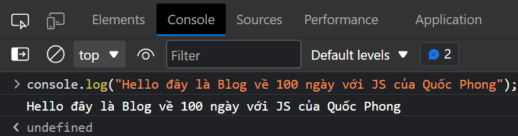
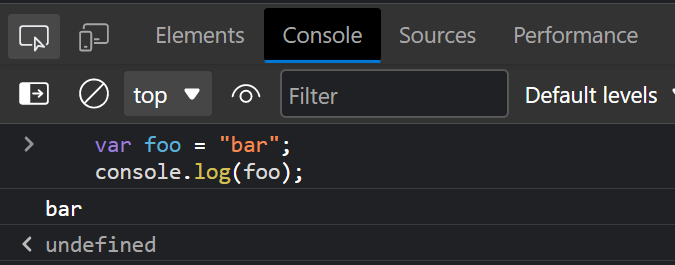
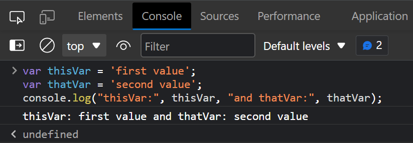
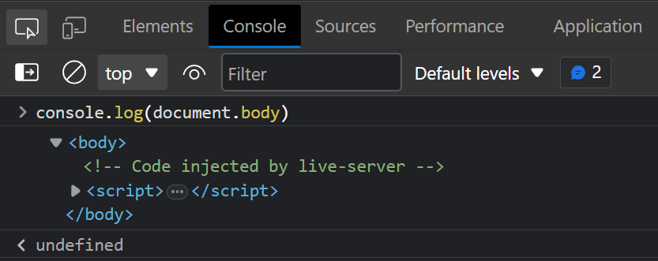
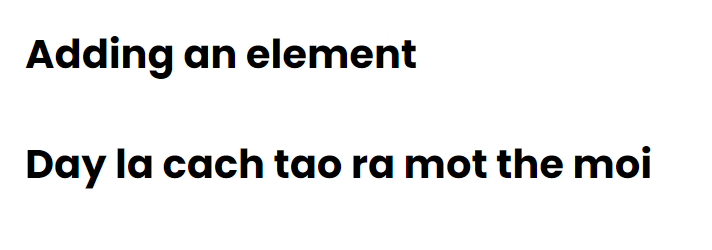

# BẮT ĐẦU VỚI JAVASCRIPT

## 1. SỬ DỤNG console.log():

### Giới thiệu:
Tất cả các trình duyệt web hiện đại, Node.js cũng như hầu hết các môi trường JavaScript khác đều hỗ trợ việc ghi nhận tin nhắn vào bảng điều khiển bằng một bộ các phương thức logging. Phương thức phổ biến nhất trong số này là console.log().

Trong môi trường trình duyệt, hàm console.log() được sử dụng chủ yếu cho mục đích gỡ rối.

### Cách dùng:
Ta có thể sử dụng **console.log()** bằng nhiều cách như có thể ấn phím F12 và viết code ở trong phần Console.
```javascript
    console.log("Hello đây là Blog về 100 ngày với JS của Quốc Phong");
```



Sau khi in ra đoạn văn ta thấy chương trình trả về thêm một giá trị undefined. Điều đó xảy ra bởi vì hàm console.log() lúc này không in ra một giá trị rõ

### In ra một biến
console.log() có thể nhận các giá trị khác như là biến, hàm, ... không chỉ in ra mỗi đoạn văn. Ở phần này các bạn không cần hiểu biến và hàm là gì. Chúng ta sẽ sử dụng chúng trước để có một cách nhìn trực quan khi sử dụng console.log()

Ví dụ:
```javascript
    var foo = "bar";
    console.log(foo);
```



Ta có thể in ra 2 hoặc nhiều biến hơn nữa bằng cách sử dụng dấu phẩy để ngăn cách các giá trị hoặc biến với nhau và khoảng trắng sẽ được tự thêm vào khi khai báo như thế

```javascript
    var thisVar = 'first value';
    var thatVar = 'second value';
    console.log("thisVar:", thisVar, "and thatVar:", thatVar);
```



### Định dạng

Ta cũng có thể định dạng các kiểu in tương tự như trong ngôn ngữ lập trình C
```javascript
    var greet = "Hello", who = "World";
    console.log("%s, %s!", greet, who);
```

### LƯU Ý: Những phần dưới đây là nâng cao nếu bạn mới bắt đầu học thì hãy sang phần bài tiếp theo và tự luyện tập với hàm console.log() bằng cách:

```text
    Bài tập: Hãy sử dụng hàm console.log để in ra những thông tin sau:
        - Họ và tên
        - Địa chỉ
        - Giới tính
        - Nơi sinh
        - Lý do học lập trình
```

### In object

Ta cũng có thể in những phần đã được trả về từ API

```javascript
    console.log({
         'Email': '',
         'Groups': {},
         'Id': 33,
         'IsHiddenInUI': false,
         'IsSiteAdmin': false,
         'LoginName': 'i:0#.w|virtualdomain\\user2',
         'PrincipalType': 1,
         'Title': 'user2'
    });
```

### In những thành phần thuộc HTML
Ta có thể sử dụng DOM để hiển thị các phần tử của HTML

```javascript
    console.log(document.body);
```



## 2. SỬ DỤNG DOM API
DOM là từ viết tắt của **Document Object Model** nó giúp ta thể hiện các phần tử của HTML một cách cấu trúc tương tự XML

Thiết lập thuộc tính textContent của một phần tử là một cách để đưa văn bản ra màn hình trang web.

Ở đây ta dùng id để thiết lập cho mục tiêu cần in ra màn hình:

```html
    <p id="paragraph"></p>
```

Để có thể thay đổi nội dung của nó ta cần đoạn Javascript sau:

```javascript
    document.getElementById("paragraph").textContent = "Chào mừng bạn đến với 100 ngày học Javascript cùng Quốc Phong";
```
Kết quả:


Thêm một ví dụ khác chúng ta có thể tạo ra một thẻ mới và thêm nội dung vào trong thẻ đó bằng javascript

==HTML==
```html
    <body>
        <h1>Adding an element</h1>
    </body>
```

==Javascript==
```javascript
    var element = document.createElement('p');
    element.textContent = "Day la cach tao ra mot the moi";
    document.body.appendChild(element); //add the newly created element to the DOM
```
Kết quả:



==Lưu ý:== Những việc chúng ta thực hiện với DOM để lắng nghe các sự kiện hoặc những thay đổi mà chúng ta sử dụng bằng DOM thì các bạn nên để chúng ở dưới cùng của thẻ Body để khi website chúng ta đã load hết những phần giao diện cần thiết những đoạn sự kiện, animation dùng Javascript sẽ được thực thi.

Hãy đọc thêm phần này về cách sử dụng JS: https://stackoverflow.com/questions/779379/why-is-settimeoutfn-0-sometimes-useful

## 3. Sử dụng window.alert();

Phương thức alert hiển thị một hộp cảnh báo trực quan trên màn hình. Tham số của phương thức alert sẽ được hiển thị cho người dùng dưới dạng văn bản hay một hộp thông báo.

Ta có thể ghi bằng 2 cách như sau:

```javascript
    window.alert("Day la cach 1");
    alert("Day la cach 2");
```


